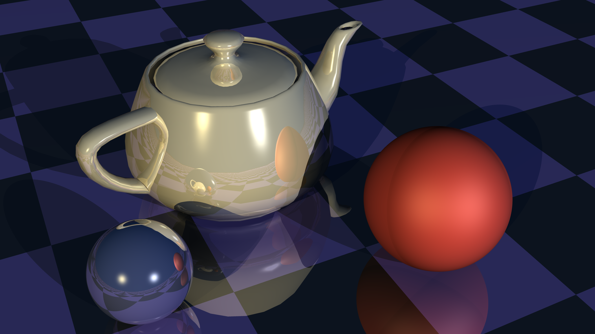
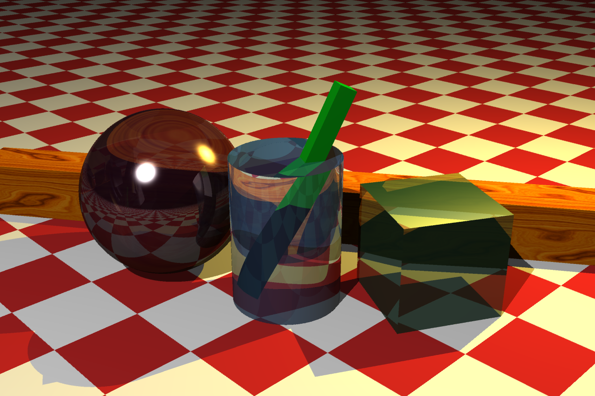

# RayScale
RayScale is a network distributed, 3D renderer based on the ray tracing algorithm. Written in Node.js / TypeScript, RayScale is designed for scaling out using containers. The objectives of RayScale as a working project is to explore and demonstrate concepts such as:

 - Parallel batch processing, gain performance by breaking a slow & complex operation into smaller chunks
 - The simplicity of using containers as a unit of scale
 - Job & task synchronization in a distributed architecture
 - A microservices based architecture
 - Using a container cluster such as Kubernetes
 - Use of Azure services such as Azure Container Instances to serverlessly provide massive scale
 - RESTful APIs
 - Use of TypeScript with Node.js and Express

## What Is Ray Tracing
In computer graphics, ray tracing is a rendering technique for generating an image by tracing the path of light as pixels in an image plane and simulating the effects of its encounters with virtual objects. The technique is capable of producing a very high degree of visual realism, usually higher than that of typical polygon based scanline rendering methods, but at a greater computational cost.

## Ray Tracing Features
It is not the goal of this project to create a completely fully featured ray tracer, as the scope of that is almost limitless. 
RayScale currently provides:
- Primitive objects: Spheres, planes, cubeboids & cylinders
- Complex polygon meshes in .obj format
- Texture mapping; images (PNG) and checker pattern
- [Blinn-Phong illumination model](https://en.wikipedia.org/wiki/Phong_reflection_model) with per object surface properties
- Multiple coloured light sources
- Refractive transparency
- Positionable camera, FOV and image output at any resolution
- Job & scene definition language (YAML) 
- Anti-aliasing

## Sample Images
These are some sample images rendered with RayScale

### [📷 Complete Gallery Here](examples/renders)

# Core Components (Microservices)
RayScale is comprised of two separate microservices, the *Controller* and the *Tracers*. Both are written in Node.js using TypeScript, and all interaction to/from these services is via REST API (using Express).

RayScale is intended to be run with a single *Controller* and one or more *Tracers* (either on the same machine as the controller (each on different TCP ports) or elsewhere on the network). Tracers can be started & stopped at any point, more added etc. and the *Controller* keeps track of tracers via health checks much like a network load balancer.

## Basic System Architecture

## Controller
Acts as control point and the user's main interface with RayScale. It provides the API and Web UI for submitting jobs. It also coordinates the *Tracers*, keeps tracks of which tracers are online etc. The *Controller* splits up jobs into tasks and sends them to *Tracers*, and also reassembles & saves the results as they are sent back
### [📘 Controller documentation](controller/readme.md)

## Tracer 
*Tracers* do the actual rendering work, by ray tracing the tasks given to it via the *Controller*. Each *Tracer* registers itself with the *Controller* on startup. The *Tracer* carries out scene parsing and also the work of actually computing the ray tracing algorithm of the task it has been given. Once completed, the results are POSTed back to the controller as a binary buffer of image data
### [📘 Tracer documentation](tracer/readme.md)

# Web UI
The *Controller* provides a simple web UI, available at `http://<controler-addres>:<port>/ui`. The UI allows for:
- Job YAML editing and submission
- Viewing job results, rendered images and other outputs
- Viewing list of tracers online

  

# Objects & Terms 
As well as the *Controller* & *Tracer*, RayScale has several named objects and concepts which it's worth understanding:
- **JobInput** - A YAML document passed to the Controller to start a *Job*, at a high level it contains three things; job name, image dimensions and a scene definition. Full details are in the [job & scene reference guide](docs/reference.md)
- **Job** - Internal representation of a *Job*, managed by the controller, holding its status, an array of tasks, start time etc. When a job is completed most of this information is placed in `result.json`
- **Scene** - A description of what is to be rendered, consists of sets of parameters defining the camera position, lights and most importantly all the objects that make up the scene. The objects are described by type, position, size and their appearance. Full details are in the [job & scene reference guide](docs/reference.md)
- **Tasks** - The controller divides a *Job* into *Tasks*. You can specify the number of tasks you want your job split into, if no number is given, the system will simply allocate one task per tracer. A good rule of thumb for quickest rendering is to split the scene into twice as many tasks as you have tracers.  
The *Controller* schedules *Tasks* by creating a queue and sending them off the queue to idle *Tracers*. Only a single *Task* is allocated to a *Tracer* at a time, once a *Task* is completed another will be sent to the *Tracer* off the queue.  
The *Task* contains the above *Scene* definition, the overall image size, and also the size of the sub-slice the task is to generate. The *Tracer* will only render the portion of the overall image given to it in the *Task*

# Running RayScale
As RayScale uses Node.js and is also containerised there are numerous ways you can run RayScale, here are a few that have been tried tested:
- Locally - without Docker
- Locally - with Docker
- In Kubernetes
- In [Azure Container Instances](https://azure.microsoft.com/en-gb/services/container-instances/)

#### [📘 Running & Deploying RayScale](docs/running.md)

# Scene Definition Language
The way *Scenes* and the *JobInput* are defined is yia YAML, there's a full guide to the objects and their properties linked below. However it is recommend to use one of the included example jobs as a starting point rather than write a new job & scene YAML from scratch.
#### [📘 Job & Scene Definition Reference](docs/reference.md)

# Limitations and Design Constraints
These constraints are either by design or known issues
 - The raytracer has some known issues, including:
   - Cones can render incorrectly at certain angles
   - Meshes don't support image texture mapping (requires UV mapping, deemed out of scope)
   - Meshes assume a normals are smoothed all over the object (requires smoothing group support,not going to happen any time soon)
   - Transparency hasn't been fully tested for accuracy  
 - The system only allows for a single *Job* to be running at any time.
 - Failure of any one *Task*, will result in a failed/incomplete job. *Job* and *Task* recovery is considered out of scope, and unlikely to be resolvable.
 - *Tracers* do not check to see if the *Controller* is active, it is assumed the controller is online at all times. Should the *Controller* be restarted for any reason, all *Tracers* will also need to be terminated and restarted. 

